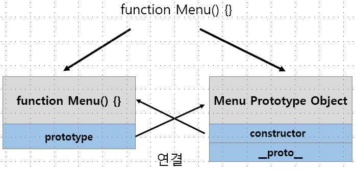
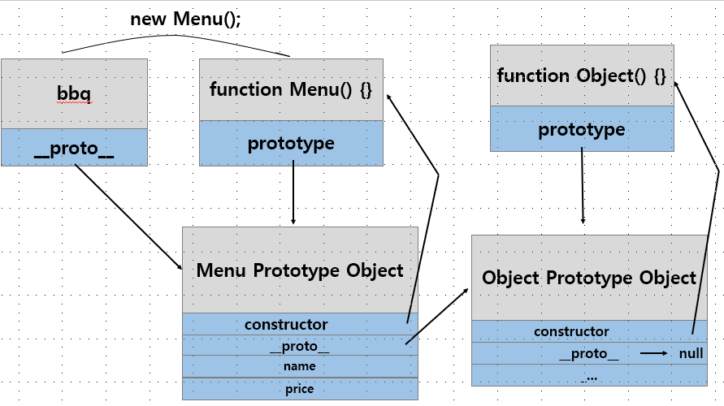
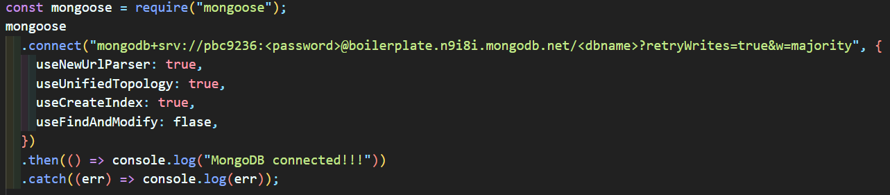
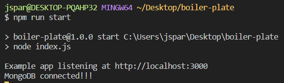
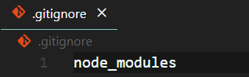

## Prototype

JS는 class 기반의 객체지향 언어로 대부분 알고 있다. 하지만, JS는 ES6에서 생긴 개념인 class가 직접 존재하는 게 아니다. Prototype을 통해 생성되고 여기서 생성 자체는 함수를 사용하기 때문에 객체 → 프로토타입 → 함수 → 객체로 이상한 Cycle이 형성된다고 생각할 수도 있다.

ES6에서 class의 개념이 나온 것은 맞지만 오해하지 말야아 할 것은, prototype이 class로 변화된 것은 아니고, 원래도 js는 class의 기능을 묘사하기 위해 prototype로 상속같은 것을 구현 할 수 있었고 이를 문법적으로 쉽게 만들어 사용 할 수 있게 한 것이 ES6의 class이다.

JS에서 객체가 생성되면 언제나 함수로써 생성이 된다.

```javascript
function Menu() {} // 함수 선언

const MenuObject = new Menu(); // 함수로 객체 인스턴스 생성
```

이렇게 생성된 객체는 해당 객체의 Prototype Object 생성과 함께 연결된다.



쉽게 말해서 객체 생성의 부모를 만들어주고(Prototype Object) 그 관계를 연결(Prototype)해 주는 것이다.

생성된 Prototype Object는 constructor와 **proto**를 갖게 된다.

constructor는 Prototype Object로 인스턴스 생성시 new로 객체 생성을 할 수 있게 해준다.

**proto**는 인스턴스 생성 시 Prototype Object와의 연결 관계를 만들어 준다.

```javascript
function Menu() {} // 객체 생성 및 Prototype Object 연결

Menu.prototype.name = "chicken"; // 객체의 prototype 조작
Menu.prototype.price = "5000원";

var bbq = new Menu(); // constructor 예약어로 만든 인스턴스
var kyochon = new Menu();

console.log(bbq.price); // 5000원
```



Prototype 속성은 함수만 갖지만 **proto**는 모든 객체가 갖고 있다.

따라서 인스턴스 수준에서는 인스턴스의 Prototype Object의 변수를 가져다 쓰는 것이 가능해지고, 만약 여기에도 존재하지 않는다면 Object Prototype Object까지 거슬러 올라가서 확인하고 값이 없다면 undefined를 리턴하는 구조이다.

이렇게 \***\*proto\*\***를 통해 상위 프로토타입들과의 연결성이 Chain처럼 연결되어 있어서 이를 **Prototype Chaining**이라고 한다.

JS는 OOP(Object Oriented Programming)의 class를 묘사하기 위해 prototype의 개념이 생겼다.

Prototype이 생성되면 Prototype Object와 Prototype Link가 함께 따라간다.

## meta태그(viewport)

```javascript
<meta
  name="viewport"
  content="width=device-width,
      initial-scale=1.0,
      user-scalable=no,
      maximum-scale=1.0,
      minimum-scale=1.0"
/>
```

1. 너비를 장치너비로 설정
   "width=device-width"
2. 초기 화면 배율(initial-scale) 설정(zoom 레벨 설정)
   "inital-scale=1.0"
   1.0은 100%와 같음.
3. 최소 최대 화면 배율 설정(minimum and maximum scale)
   minimum-scale=1.0, maximum-scale=1.0
   최소 설정은 사용자가 너무 극단적으로 화면 축소하는 것을 방지함.
   최대 화면 배율 설정은 극단적으로 화면 확대하는 것을 방지함.
4. 사용자가 브라우저의 확대축소를 불가능하게 한다.

   user-scalable=no

## 몽고 DB 연결하기

1. 로그인 후 Create Cluster
2. Cluster 생성 완료되고 나면, connect 버튼을 누르고 몽고DB 유저 생성(아이디, 비번 기억해야 함! 나중에 앱과 연결할 때 사용됨.)
3. Mongoose 다운로드(Mongoose는 간단히 말해서, 몽고DB를 편하게 쓸 수 있는 Object Modeling Tool이다.

// index.js



위의 코드와 같이 작성해주고, <password> 자리에는 아까 몽고DB 유저를 생성할 때 설정했던 비밀번호를 입력해준다.

몽고DB가 잘 연결되었는지 확인하기 위해 then 메소드를 사용하였다. 연결이 성공했다면 콘솔창에 MongoDB connected!!!라는 메세지를 출력될 것이다. 만약 연결에 실패했다면 콘솔창에 에러 메세지를 출력할 것이다.



연결이 성공되어 터미널에 MongoDB connected!!!라는 메세지가 출력되었다.

## MongoDB Model && Schema

Mongoose model : Schema를 감싸주는 역할이며 데이터들을 생성하고, 검색하고, 업데이트하고, 제거하기 위해 데이터베이스에게 인터페이스를 제공한다.

Mongoose schema : 문서 구조, 기본 값들, 유효성 검사를 정의한다.

## git 명령어들

- **git init** : 새로운 git 리포지토리를 만든다.
  git init 명령어를 실행하면 현재 작업 중인 디렉토리에 .git 폴더를 생성한다.
  .git 폴더는 새로운 리포지토리에 대한 모든 필수적인 git 메타 데이터를 담고 있다.
- **git status** : working directory와 staging area의 상태를 보여준다.
  어떤 변화가 stage되었고, 어떤 변화가 stage되지 않았는지, 어떤 파일들이 git에 의해 추적되지 않는지를 볼 수 있다.
- **git log** : 커밋된 프로젝트 히스토리에 대한 정보를 보여준다.
- **git commit** : 로컬 리포지토리에 변화를 저장한다.
- **git push** : 원격 리포지토리에 로컬 리포지토리의 내용을 업로드한다.

## node_modules는 보통 git에 올릴 때 제외시킨다.

1. .gitignore 파일 생성.
2. .gitignore 파일 안에 node_modules를 써준다.

   

여기서 주의할 점은 git init → git add . 를 한 후에 이 절차를 수행한다면 node_modules 폴더는 git에 여전히 올라가게 된다.

파일들이 staging area에 있기 전에(즉, git add . 명령어를 실행하기 전에) 이 절차를 수행해야 한다.

만약 git add . 명령어를 실행한 뒤라면, git rm —cached node_modules -r 명령어를 실행하여 이전의 node_modules에 대한 기록을 지워준다.

## SSH를 이용해 GITHUB 연결

내 컴퓨터의 로컬 리포지토리와 Github의 원격 리포지토리 간에 안전한 통신을 위해서는 SSH(Secure Shell)를 설정해줘야 한다.

1. 존재하는 SSH가 있는지 체크.

터미널에 ls -al ~/.ssh를 입력하여 실행.

2.  SSH Key를 만든다.

3.  SSH Agent를 Background에 킨다.

4.  SSH Private Key를 SSH-AGENT에 넣는다.

[Generating a new SSH key and adding it to the ssh-agent](https://docs.github.com/en/github/authenticating-to-github/generating-a-new-ssh-key-and-adding-it-to-the-ssh-agent)

5. 생성된 SSH Public Key를 깃헙에 넣는다.

[Adding a new SSH key to your GitHub account](https://docs.github.com/en/github/authenticating-to-github/adding-a-new-ssh-key-to-your-github-account)
