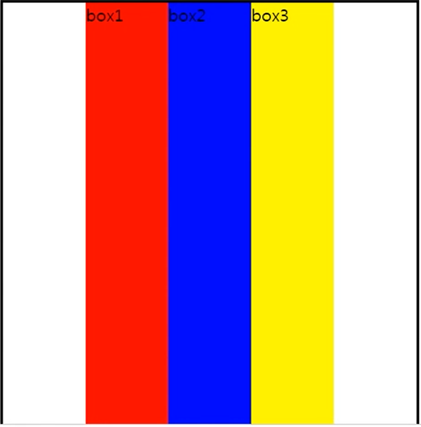

# flex

부모 요소에 display: flex를 지정해주면, 자식 요소들이 가로로 바뀐다. 자식 요소들의 높이가 가장 높이가 긴 요소의 높이와 같아진다.

```html
<div class="wrap">
  <div>box1</div>
  <div>box2</div>
  <div>box3</div>
</div>
```

```html
.wrap {
  display: flex;
  justify-content: center;
  width: 90%;
  height: 500px;
  margin: 20px auto;
  border: 2px solid;
}
```



display: flex를 이용하면 단순히 justify-content: center를 이용하여 자식 요소들을 가운데 정렬시킬 수 있다.

하지만, float 를 이용하게 된다면

```html
.wrap {
  width: 90%;
  height: 500px;
  margin: 20px auto;
  border: 2px solid;
	text-align: center;
}
.wrap > div {
  display: inline-block;
}
```

이런 식으로 자식 요소들을 inline 요소로 취급하여 text-align: center를 하거나,

```html
<div class="wrap">
  <div class="child-box">
    <div>box1</div>
    <div>box2</div>
    <div>box3</div>
  </div>
</div>

.wrap {
  width: 90%;
  height: 500px;
  margin: 20px auto;
  border: 2px solid;
}
.child-box {
  width: 300px;
  margin: 0 auto;
}
.child-box > div {
  width: 33.3%;
}
```

자식 요소들을 div로 감싸주어서 너비 설정 후 block 요소의 가운데 정렬 방식을 이용한다. (margin: 0 auto)

flex-flow : [flex-direction] [flex-wrap]

flex : [flex grow] [flex shrink] [flex basic]]

[flex grow]와 [flex shrink] 가 같으면, flex : [하나의 숫자]로 설정한다.

# 반응형 웹 디자인의 레이아웃 기법

Mostly Fluid, Column Drop, Layout Shifter, Tiny Tweaks, Off Canvas

daum troy

반응형에서는 px 단위를 사용하지 않고 % 단위를 사용한다.

이미지를 사용할 때 조심해야 한다.

360 * 640 : 휴대폰 화면의 실제 크기

1440 * 2560 

CSS Pixel-Ratio: 4

360 * 640의 화면에서 이미지가 선명하게 보이도록 하려면 1440 * 2560 사이즈의 이미지를 사용해야 한다. 이를 CSS로 처리해줘야 한다.

PC에서는 1px이 1px로 보이지만, 휴대폰에서는 1px이 16px 즉 압축되어 보인다. 그래서 휴대폰에서 화질이 더 좋다. PC 이미지를 휴대폰에 사용할 때 주의!!!

모바일에서 이미지를 사용할 때 1440 * 2560 사이즈를 사용하자.

## 대괄호 표기법(Bracket Notaion) vs 점 표기법(Dot Notation)

JavaScript에서, 모든 객체 키는 문자열이다(심볼이 아닌 한). 비록 그것을 문자열 형으로 입력하지 않아도, 항상 내부적으로 문자열로 변환된다.

JavaScript는 문장을 해석(또는 박스 해제)한다. 대괄호 표기법을 사용하면, 첫 번째 열린 대괄호 [ 를 보고 닫힌 대괄호 ] 를 찾을 때까지 진행한다. 그때에만, 그 문장을 평가한다.

그러나, 점 표기법에서 이것은 발생하지 않는다.

```html
const person = { 
  age: 24
};

const key = "age";

person.key // undefined. There is no key called "key" on the person object
person[key] // 20. There is a key called "age" on the person 
```

person.key는 undefined를 반환한다. 왜냐하면 자바스크립트는 key라는 변수의 값보다는 "key"(a string, because object keys are strings)라는 key를 찾기 시작하기 때문이다.

person[key]: 먼저 "age"인 key를 평가한다. mouse["age"]는 24를 리턴한다.

```html
const details = {
  props: 'name'
}

const person = {
  name: 'Byungchan'
}

person.details.props
// Error. details doesn't exist on person
person[details["props"]]
// 'Byungchan'. details["props"] evaluates to "name". person["name"] has the value 'Byungchan'
```

## What's the output?

```html
class Chameleon {
  static colorChange(newColor) {
    this.newColor = newColor;
    return this.newColor;
  }

  constructor({ newColor = 'green' } = {}) {
    this.newColor = newColor;
  }
}

const freddie = new Chameleon({ newColor: 'purple' });
console.log(freddie.colorChange('orange'));
// TypeError
```

reason) The colorChange function is static. **Static methods are designed to live only on the constructor in which they are created, and cannot be passed down to any children.** Since freddie is a child, the function is not passed down, and not available on the freddie instance: a TypeError is thrown.

line-height에서 지정한 높이는 폰트사이즈가 해당 line height 보다 크지만 않으면 지정한 높이 안에서 폰트사이즈에 상관없이 중앙에 오게 된다.

### white-space 속성값

- normal(기본값) : 공백을 여러 개 넣어도 공백 1개만 표시, 글이 길어지면 텍스트가 자동 줄바꿈됨.(wrap)
- nowrap : 공백을 여러 개 넣어도 공백 1개만 표시, 텍스트가 길어도 줄바꿈되지 않고 같은 줄에 계속 표시
- pre : 공백을 코드에 있는 그대로 표시함. <pre> 태그처럼 행동함. 코드에 줄바꿈이 없다면 줄바꿈이 되지 않음.
- pre-wrap : 공백을 코드에 있는 그대로 표시함. 코드에 줄바꿈이 없어도 자동 줄바꿈이 됨.
- pre-line : 공백을 여러 개 넣어도 1개만 표시. 코드에 줄바꿈이 없어도 자동 줄바꿈이 되며, 코드에 줄바꿈이 있을 때도 그대로 표시.